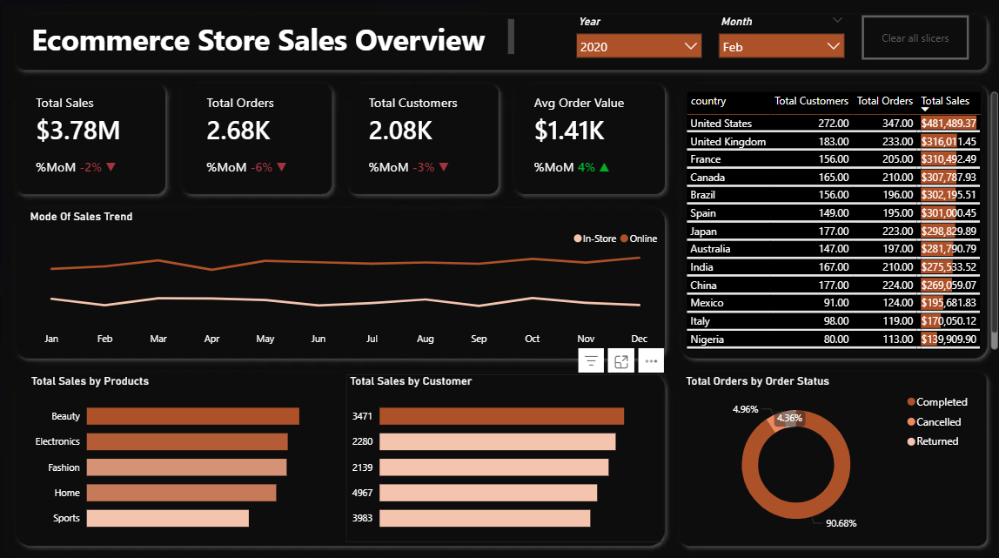
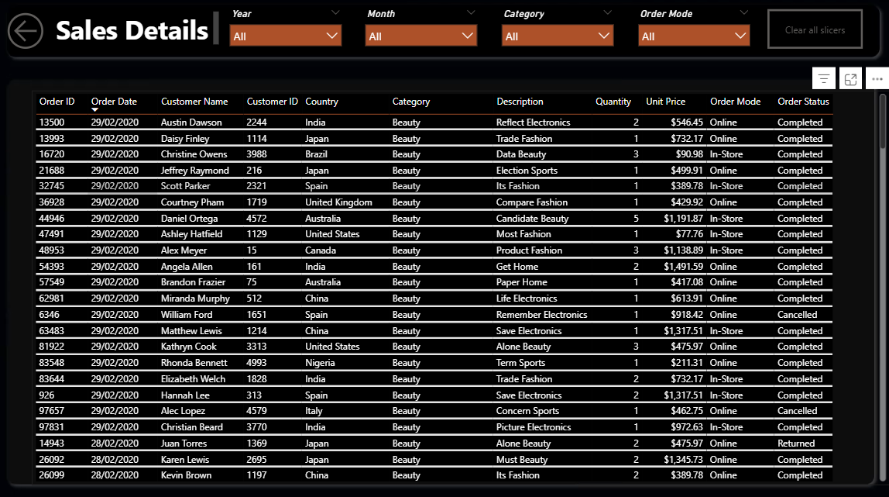

# 📊 Ecommerce Sales Dashboard

A data analytics project simulating a real-world e-commerce business, focusing on **data cleaning, transformation, and performance analysis** using SQL and Power BI.

This project demonstrates an **end-to-end workflow** from raw data → cleaned datasets → interactive dashboard for business insights.

---

## 🚀 Project Summary

* Synthetic dataset (2020–2022)
* Data cleaned and transformed using **PostgreSQL**
* Analysis-ready tables created for reporting
* Interactive dashboard built in **Power BI**
* Project fully documented using **GitHub**

---

## 📌 Key Features

* SQL-based data cleaning and validation
* Handling of nulls, duplicates, and inconsistencies
* Standardization of key fields (gender, country, order status)
* KPI-driven Power BI dashboard
* Drill-through for detailed transaction analysis

---

## 📊 Dashboard Overview

### 🔹 Sales Overview

* KPIs: Total Sales, Orders, Customers, AOV, %MoM
* Sales trends (Online vs In-Store)
* Sales by category, customer, and country
* Order status distribution

📷 *Dashboard Preview:*

---

### 🔹 Sales Details (Drill-through)

* Detailed transaction-level view
* Drill-through from product category
* Includes customer, product, and order data

📷 *Dashboard Preview:*

---

## 🔗 Live Dashboard

 👉 [Click To View Live Dashboard](https://app.powerbi.com/groups/me/reports/b603f702-cf7c-4031-992a-271a9fc17f48?ctid=6856eed6-b8b2-4e6f-a212-806bf9d2e509&pbi_source=linkShare)

---

## 🛠️ Tools Used

* **SQL (PostgreSQL)**
* **Power BI**
* **GitHub**

---

## 🧠 Insights Covered

* Sales trends over time
* Customer behavior
* Product performance
* Online vs In-store comparison
* Order completion vs cancellation

---

## ⚡ Why This Project

* End-to-end data workflow
* Realistic data cleaning process
* Business-focused dashboard
* Clean and modern design
* Drill-through capability

---

## 📘 Documentation

Detailed steps and logic can be found in the repo:
- 📂 Dataset: [datasets](./datasets)
- 📜 SQL Scripts: [Scripts](./Scripts)
  
---

## 👤 Author

**Akah Divine** 
|| 
Data Analyst 

